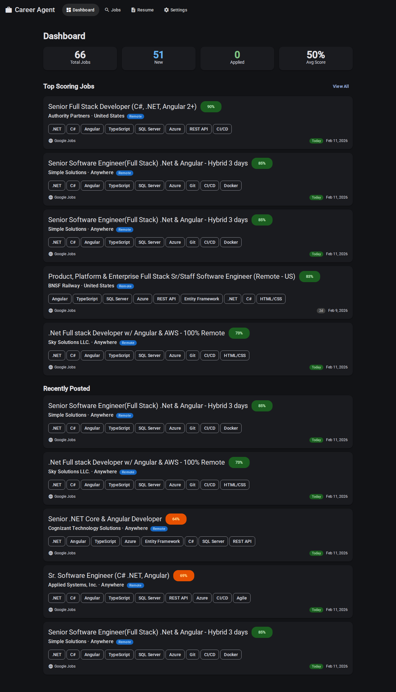
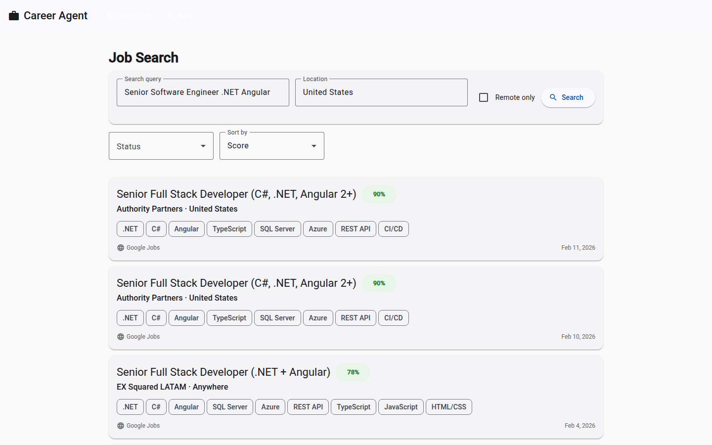
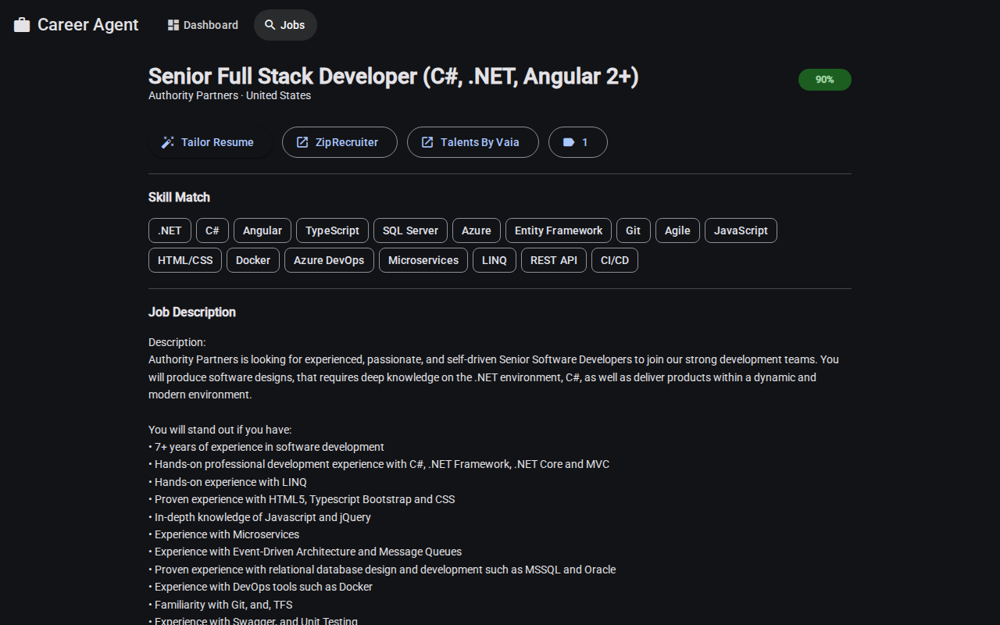

# Career Agent

AI-powered job search and resume tailoring tool. Aggregates job listings from Google Jobs and Adzuna, scores them against your profile, and uses Google Gemini to generate tailored resumes and cover letters.

## Screenshots

### Dashboard
Overview with job stats, top scoring matches, and recently posted listings.



### Job Search
Search and filter jobs by query, location, status, and relevance score. Location filter shows remote jobs and/or jobs within a radius of your home address.



### Job Detail
Full job posting with skill match analysis and direct apply links (LinkedIn, Indeed, ZipRecruiter, etc.).



### Resume Tailor
AI-generated tailored resume and cover letter side-by-side with the job description.


## Features

- **Multi-Source Job Search** — Aggregates jobs from Google Jobs (via SerpAPI) and Adzuna, with cross-source deduplication
- **Background Job Fetching** — Automatically searches multiple queries on a 2-hour cycle for continuous coverage
- **Location Filter** — Show remote jobs and/or jobs within a radius of your home address (geocoded via OpenStreetMap Nominatim)
- **Direct Apply Links** — One-click apply buttons for LinkedIn, Indeed, ZipRecruiter, and other job boards
- **Relevance Scoring** — Automatically scores and ranks jobs against your skills and experience
- **Days-Old Badges** — Visual freshness indicators on job cards (Today, 1d, 2d, etc.)
- **Resume Management** — View and edit your master resume directly in the browser
- **Resume Tailoring** — AI rewrites your resume to match specific job descriptions using Google Gemini (free tier)
- **Cover Letter Generation** — Generates targeted cover letters alongside each tailored resume
- **PDF Export** — Download tailored resumes as PDF
- **Model Fallback** — Automatically cycles through multiple Gemini models on rate limits

## Tech Stack

- **Backend**: ASP.NET Core 8 Minimal API, EF Core, SQLite
- **Frontend**: Angular 21, Angular Material
- **AI**: Google Gemini API (free tier — gemini-2.5-flash, gemini-2.5-flash-lite, gemini-3-flash)
- **Job Data**: SerpAPI (Google Jobs aggregator), Adzuna API
- **Testing**: xUnit, Moq, FluentAssertions

## Getting Started

### Prerequisites

- [.NET 8 SDK](https://dotnet.microsoft.com/download/dotnet/8.0)
- [Node.js 20+](https://nodejs.org/)
- [SerpAPI key](https://serpapi.com/) (free tier available)
- [Adzuna API credentials](https://developer.adzuna.com/) (free tier available)
- [Google Gemini API key](https://aistudio.google.com/apikey) (free tier)

### Setup

```bash
# Clone and build
git clone https://github.com/fchchen/career-agent.git
cd career-agent
dotnet build

# Configure API keys
dotnet user-secrets init --project src/Api
dotnet user-secrets set "SerpApi:ApiKey" "your-serp-key" --project src/Api
dotnet user-secrets set "Adzuna:AppId" "your-adzuna-app-id" --project src/Api
dotnet user-secrets set "Adzuna:AppKey" "your-adzuna-app-key" --project src/Api
dotnet user-secrets set "Gemini:ApiKey" "your-gemini-key" --project src/Api

# Install frontend dependencies
cd frontend && npm install && cd ..
```

### Run

```bash
# Start the API (in one terminal)
ASPNETCORE_ENVIRONMENT=Development dotnet run --project src/Api/CareerAgent.Api.csproj

# Start the frontend (in another terminal)
cd frontend && npm start
```

Open http://localhost:4200 in your browser.

### Test

```bash
dotnet test
```

## Architecture

```
src/
  Api/                  ASP.NET Core 8 Minimal API
    Endpoints/          Route handlers (JobSearch, Resume, Dashboard)
    Services/           Business logic (composite job search, scoring, remote classification)
    Data/               EF Core DbContext + SQLite
    Middleware/          Global exception handling
  Shared/               Models, DTOs, constants
frontend/               Angular 21 + Material Design
tests/
  Api.Tests/            xUnit + Moq + FluentAssertions
```

## License

MIT
